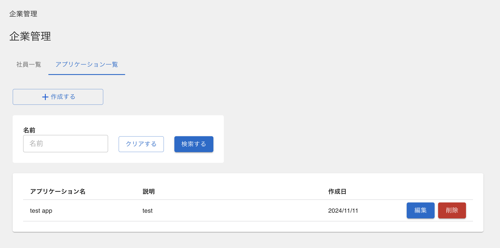
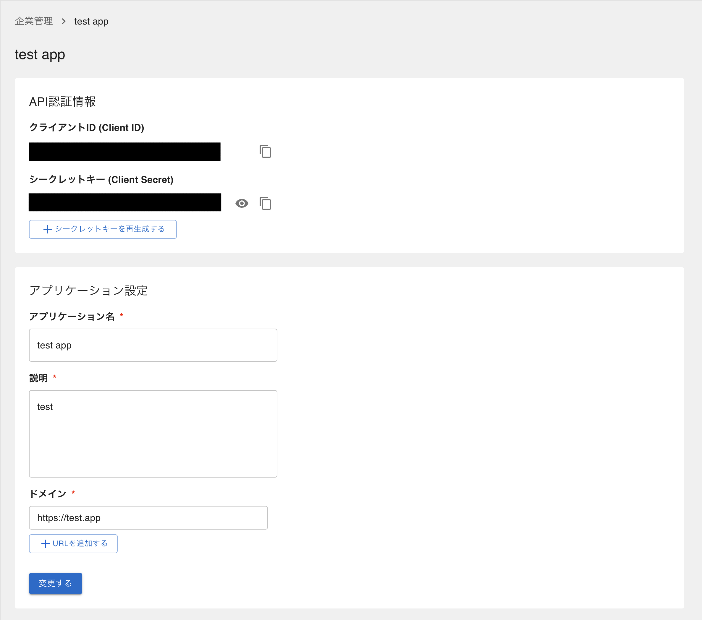

# RCDE API SDK

RCDE APIを使用するためのSDKです。

## インストール方法

npm、またはyarnを使用してインストールします。

```bash
npm install @i-con/api-sdk
# or
yarn add @i-con/api-sdk
```

## 事前準備 (2 legged oauth)

RCDEのサイトでアプリケーションを作成します。



作成したアプリの「編集」ボタンから、クライアントIDとクライアントシークレットを取得します。
また、APIを利用したいアプリのドメインを登録します。



## 使用方法

```typescript

// APIクライアントの初期化
const client = new RCDEClient({
  // RCDEのWebサイトのURL e.g. https://api.rcde.jp
  domain,
  // RCDEのアプリ設定画面で登録したドメイン
  baseUrl,
  // RCDEのアプリ設定画面で取得したクライアントIDとクライアントシークレット
  clientId,
  clientSecret,
});

// APIクライアントの認証
// この認証はAPIを利用する前に必ず行う必要があります
await client.authenticate();

// 現場の作成
const createConstructionRes = await client.createConstruction({
  name: "test constructon",
  address: "東京都千代田区一ツ橋2丁目5-10",
  contractedAt: new Date("2024-11-26"),
  period: new Date("2025-11-26"),
  advancePaymentRate: 20,
  contractAmount: 3500000000,
});

// 現場一覧の取得
const constructions = await client.getConstructionlist();

const construction = constructions[0];

// 現場情報の取得
await client.getConstruction(construction.id);

// 現場に紐づく契約の取得
const contracts = await client.getContractList({
  constructionId: construction.id,
});

const contract = contracts[0];
const buffer = fs.readFileSync("assets/bunny.csv");

// 契約にファイルをアップロード
const uploadRes = await client.uploadContractFile({
  contractId: contract.id,
  name: "bunny.csv",
  buffer,
});

```

## APIの認証手順 (3 legged oauth)

- 1. rcde上の企業管理画面を開く
- 2. アプリケーション一覧からアプリケーションを作成する
- 3. rcde上の3-leggedのログイン画面からログインする（ID/PASSはr-cdeを使うときのログインに使っているユーザー情報）
http://{rcdeのドメイン}/oauth/signIn?response_type=code&client_id={企業アプリケーション画面のクライアントID}&scope=all
※日本語の部分は必要な値を埋めてください
- 4. 上記ログイン後、企業アプリケーション画面で設定したコールバックURLへリダイレクトされる(コールバックURLのクエリ文字列の"code"に文字列が返ってくる(authCode))
- 5. authCodeを使って、http://{rcdeのドメイン}/ext/v2/oauth/token APIでAPI tokenを生成する
- 6. 2-leggedと同様にBearer tokenとしてAPI tokenを指定して、必要なAPIを叩く


